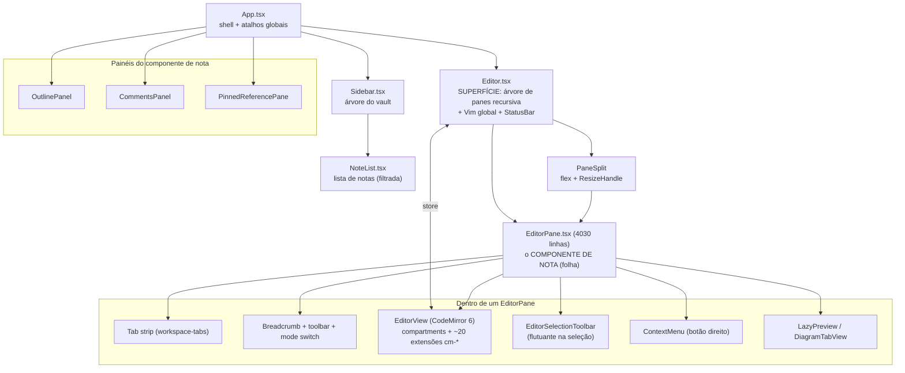
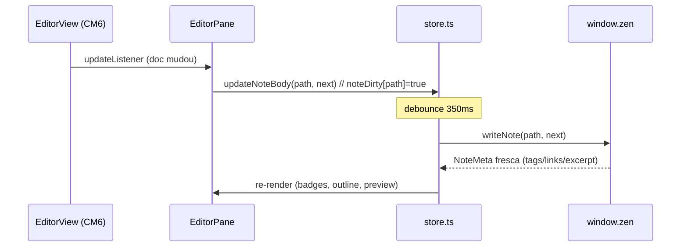

# ZenNotes — Deep Dive do Editor e do Componente de Nota

> Foco: **o editor e o componente de nota (e seus sub-componentes)** do ZenNotes. Companheiro do [zennotes-notes-core-analysis.md](zennotes-notes-core-analysis.md) (que cobre o core inteiro). Aqui é tin-tin-por-tin-tin da UI de edição: como o CodeMirror 6 é montado, como o pane de nota é composto, e o que cada sub-componente faz.
>
> Base de código: `packages/app-core/src/components/` + `packages/app-core/src/lib/cm-*`. Tudo verificado no código.

---

## 1. Árvore de componentes



Divisão de responsabilidades (do comentário de topo de cada arquivo):

- **`Editor.tsx`** → "Renders the pane-layout tree recursively: every leaf becomes an `EditorPane`; every split becomes a flex container with resize handles. Global concerns (vim command registration, the bottom StatusBar, app-level keyboard shortcuts) live here."
- **`EditorPane.tsx`** → "Per-pane concerns: the CM view, tabs, breadcrumb + toolbar, preview surface, and drag-drop zones."

---

## 2. `Editor.tsx` — a superfície (1.491 linhas)

Não é o editor de texto em si — é o **container recursivo de panes** + o que é global.

**O que faz:**

1. **Renderiza a árvore de layout** (`PaneLayout`/`PaneSplit` de `lib/pane-layout.ts`): folhas → `<EditorPane>`, splits → flex com `<ResizeHandle>` entre filhos. É isso que dá **split panes** (vários editores lado a lado).
2. **Registra os comandos Vim uma vez** (`vimCommandsRegistered`), traduzindo os keymaps configuráveis do app para o formato do Vim (`@replit/codemirror-vim`).
3. Monta a **`StatusBar`** (rodapé: modo Vim, contagem de palavras, posição do cursor…).
4. **Atalhos de nível app** (fechar tab, navegar panes, foco em painéis) via `matchesShortcut` + `KeymapOverrides`.
5. **Lazy-load do módulo do editor** — o `Editor` é `lazy()` e há `scheduleEditorModuleWarmup()` (pré-carrega o chunk do CM em idle para o primeiro open ser instantâneo).

**Tradução de keymap app → Vim** (`toVimSequence`, `toVimKeyName`): converte `Ctrl+W h` etc. para `<C-w>h`; limpa mappings padrão do Vim que colidiriam (`DEFAULT_VIM_MAPPINGS_TO_CLEAR`: `gd`, `<C-w>h/j/k/l`, `zc/zo/zM/zR`) para que os bindings do app vençam.

---

## 3. `EditorPane.tsx` — o componente de nota (4.030 linhas)

É o coração da UI. Um pane = **uma pilha de tabs + um EditorView + a preview surface + toolbars**. Cada pane tem seu path ativo, modo e refs de CM.

### 3.1 Partes visuais

| Parte                      | O que é                                                                                                                    |
| -------------------------- | -------------------------------------------------------------------------------------------------------------------------- |
| **Tab strip**              | Tabs abertas no pane (`workspace-tabs.ts`, overflow via `tab-strip-overflow.ts`, scroll memory via `tab-scroll-memory.ts`) |
| **Breadcrumb + toolbar**   | Caminho da nota + botões (modo, ações)                                                                                     |
| **Mode switch**            | Botões **Edit / Split / Preview** (`MODES` com `keymapId` `global.modeSplit`/`modeEdit`/`modePreview`)                     |
| **EditorView**             | A instância CodeMirror 6 (§4)                                                                                              |
| **EditorSelectionToolbar** | Toolbar flutuante ao selecionar texto (§9)                                                                                 |
| **ContextMenu**            | Menu de botão direito no editor                                                                                            |
| **Preview surface**        | `LazyPreview` (markdown renderizado) ou `LazyDiagramTabView` (§8/§10)                                                      |
| **Drag-drop zones**        | Soltar arquivos/imagens/notas no pane                                                                                      |

### 3.2 Modos por path (`edit` | `split` | `preview`)

O modo é **por caminho de nota**, não global: `modesByPath` + `paneModeForPath(modesByPath, activeTab)` (`lib/pane-mode.ts`). Assim cada nota lembra se você a deixou em edição, split ou só preview. `split` mostra editor + preview lado a lado, com sincronização de scroll (`shouldSyncPreviewFromEditorViewport`).

### 3.3 Refs e ciclo de vida

`viewRef` guarda o `EditorView`; `setEditorViewRef` registra a view no **store** (para comandos globais agirem no editor ativo). Há refs de **Compartment** para cada feature reconfigurável (§4.2).

---

## 4. O motor: CodeMirror 6 (montagem exata)

O ZenNotes usa **CodeMirror 6 puro** (`@codemirror/state`, `/view`, `/commands`, `/language`, `/search`, `/autocomplete`, `/lang-markdown`) — **não** um wrapper React. O pane cria e gerencia o `EditorView` na mão. Isso dá controle total sobre extensões e performance.

### 4.1 Criação da view (`EditorPane.tsx:1466`)

```ts
const state = EditorState.create({
  doc: initialBody,
  extensions: [
    appMarkdownSnippetExtension(),        // snippets de markdown
    vimCompartment.of(vimMode ? vim() : []),
    historyCompartment.of(history()),     // undo/redo
    drawSelection(),
    highlightActiveLine(),
    taskJumpHighlightField,               // StateField: realce ao pular pra uma task
    yankHighlightExtension,               // realce do yank (Vim)
    commentDecorationField,               // StateField: sublinhado de comentários
    wordWrapCompartment.of(wordWrap ? EditorView.lineWrapping : []),
    markdownCompartment.of(markdownEditingExtensions()),
    markdownSyntaxCompartment.of(markdownSyntaxHighlightExtensions()),
    livePreviewCompartment.of(livePreview ? wysiwygExtensions(renderTables) : []),
    lineNumbersCompartment.of(lineNumberExtension(mode)),
    tooltips({ parent: document.body }),
    autocompletion({ override: [slashCommandSource, dateShortcutSource,
                                wikilinkSource, wikilinkHeadingSource], … }),
    completionNavKeymap,
    editorKeymapCompartment.of(buildEditorKeymap(vimMode, keymapOverrides)),
    EditorView.domEventHandlers({ mousedown: … })   // seguir links (§8)
  ]
})
const view = new EditorView({ state, parent: el })
```

### 4.2 Compartments — o padrão-chave

Um **Compartment** permite trocar um pedaço da config **sem recriar o editor** (preserva cursor, histórico, scroll). Cada setting toggleável é um compartment, reconfigurado via `view.dispatch({ effects: compartment.reconfigure(...) })`:

| Compartment                 | Liga/desliga                             | Quando reconfigura           |
| --------------------------- | ---------------------------------------- | ---------------------------- |
| `vimCompartment`            | Modo Vim (`vim()`)                       | Toggle da setting Vim        |
| `editorKeymapCompartment`   | Keymap (`buildEditorKeymap`)             | Muda binding ou muda Vim     |
| `markdownCompartment`       | Edição markdown (§4.3)                   | Defer de doc grande / toggle |
| `markdownSyntaxCompartment` | Realce de sintaxe                        | idem                         |
| `livePreviewCompartment`    | WYSIWYG/live-preview                     | Toggle `livePreview`         |
| `lineNumbersCompartment`    | Números de linha (off/absolute/relative) | Setting                      |
| `wordWrapCompartment`       | Quebra de linha                          | Setting                      |
| `historyCompartment`        | Undo/redo                                | Reset ao trocar de doc       |

### 4.3 Builders de extensão

- **`markdownEditingExtensions()`** (`:290`): `markdown({ base: markdownLanguage, codeLanguages: resolveCodeLanguage, addKeymap:true })` + `markdownListIndentPlugin` + `frontmatterStyle` + `orderedListRenumber` + `headingFolding()` + `codeBlockFontPlugin`.
- **`markdownSyntaxHighlightExtensions()`** (`:301`): `syntaxHighlighting(paperHighlight)` (tema próprio: `tok-heading1..6`, etc.) + fallback `defaultHighlightStyle`.
- **`wysiwygExtensions(renderTables)`** (`:319`) — o bundle **live-preview / WYSIWYG**: `livePreviewPlugin` (esconde marcadores, inline) + `codeBlockFlairPlugin` + (tabelas gated por setting: `tablePlugin` + `tableVimEntry`) + `wysiwygBlocksPlugin` (blocos: blockquote bar, bullets, hr, code cards) + `hashtagExtension` (chips `#tag`) + `highlightExtension` (`==destaque==`) + `wikilinkRenderExtension` (`[[link]]` renderizado).
- **`buildEditorKeymap(vimMode, overrides)`** (`:266`): `Mod-f` (busca, quando não-Vim), `moveLineUp/Down` (reordena markdown persistindo no arquivo), `indentWithTab`, `vimAwareDefaultKeymap`, `historyKeymap`, `searchKeymap`, `completionKeymap`.

---

## 5. Catálogo das extensões `cm-*` (`packages/app-core/src/lib/`)

Cada feature de edição é uma extensão isolada e **testada** (quase toda tem `.test.ts` ao lado).

| Grupo                       | Arquivos                                                                                                     | Função                                                                       |
| --------------------------- | ------------------------------------------------------------------------------------------------------------ | ---------------------------------------------------------------------------- |
| **Wikilinks**               | `cm-wikilinks`, `cm-wikilink-render`                                                                         | Autocomplete `[[` e `[[#heading`; render/click do link interno               |
| **Tags**                    | `cm-hashtags`                                                                                                | Chip e autocomplete de `#tag`                                                |
| **Live preview / WYSIWYG**  | `cm-live-preview`, `cm-wysiwyg-blocks`, `cm-wysiwyg-compose`                                                 | Renderiza markdown inline enquanto edita                                     |
| **Slash commands**          | `cm-slash-commands`                                                                                          | Menu `/` para inserir blocos/templates                                       |
| **Snippets / datas / vars** | `cm-markdown-snippets`, `markdown-snippets-config`, `cm-date-shortcuts`, `cm-template-variables`             | Expansões, datas, variáveis de template                                      |
| **Listas**                  | `cm-markdown-list-indent`, `cm-ordered-list-renumber`                                                        | Indentar/desindentar; renumerar `1. 2. 3.`                                   |
| **Tabelas**                 | `cm-table`, `cm-table-menu`                                                                                  | Widgets de tabela + menu (gated por setting)                                 |
| **Frontmatter**             | `cm-frontmatter`                                                                                             | Estiliza o bloco `---` de topo                                               |
| **Headings / fold**         | `cm-heading-fold`                                                                                            | Dobrar seções por heading                                                    |
| **Código**                  | `cm-code-block-flair`, `cm-code-block-font`, `cm-code-languages`, `cm-highlight`, `code-block-copy`          | Card/linguagem/fonte/realce/copiar de bloco de código                        |
| **Realce (`==`)**           | `cm-highlight`                                                                                               | `applyHighlight`, `HIGHLIGHT_COLORS`                                         |
| **Vim**                     | `cm-vim-clipboard`, `cm-vim-default-keymap`, `cm-vim-display-line`, `vim-insert-escape`, `cm-yank-highlight` | Clipboard, keymap, movimento por linha visual, esc no insert, realce de yank |
| **Autocomplete nav**        | `cm-completion-nav`                                                                                          | Navegar sugestões por teclado                                                |
| **Formatação**              | `cm-format`, `format-markdown`                                                                               | `toggleWrap`, `wrapLink`, `setBlockType`                                     |

---

## 6. Autocomplete — sources plugáveis

O `autocompletion({ override: [...] })` roda 4 sources (`EditorPane.tsx:1490`):

1. **`slashCommandSource`** — dispara em `/`; render custom (`slashCommandRender`), classe `slash-cmd-option`. Insere blocos, templates, comandos.
2. **`dateShortcutSource`** — datas (ex.: `@today`).
3. **`wikilinkSource`** — dispara em `[[`; lista notas do vault; classe `wikilink-cmd-option`.
4. **`wikilinkHeadingSource`** — dispara em `[[nota#`; lista headings da nota alvo.

Navegação das sugestões: `completionNavKeymap` (setas/enter, respeitando Vim).

---

## 7. Integração Vim

- **Ativação**: `vimCompartment.of(vimMode ? vim() : [])` — liga/desliga sem recriar o editor.
- **Registro de comandos** (uma vez, em `Editor.tsx`): comandos Vim customizados (`Vim`, `getCM`) + `registerDisplayLineMotion` (movimento por linha visual).
- **Tradução de keymap**: os bindings configuráveis do app são convertidos para sintaxe Vim (`toVimSequence`) e mapeados; mappings padrão conflitantes são limpos.
- **Clipboard/yank**: `cm-vim-clipboard` (`setYankToClipboardEnabled`) + `cm-yank-highlight` (realce visual do yank).
- **Insert escape**: `applyVimInsertEscape` (jk/jj etc.) via `vim-insert-escape`.

---

## 8. Seguir links (comportamento de clique) — `EditorView.domEventHandlers.mousedown`

Regra (comentada em `EditorPane.tsx:1503`, issue #201):

- **Clique simples (botão 0, sem alt/shift)** segue um link **renderizado** (cursor fora dele, sintaxe `(url)` escondida) — igual aos `[[wikilinks]]`. Se o cursor já está **dentro** do link, o clique **edita** em vez de seguir.
- **Cmd/Ctrl-clique** sempre segue (inclusive wikilinks).
- Resolução: `extractLinkAtCursor` / `markdownLinkAt` → `followEditorLink` → `resolveInternalNoteHref` (nota), `resolveWikilinkTarget` (wikilink), `openWikilinkHeading`/`openDatabaseFromWikilink`, `externalLinkUrl` (externo), `classifyLocalAssetHref` (asset local).

---

## 9. `EditorSelectionToolbar.tsx` — toolbar flutuante (345 linhas)

Estilo Notion: aparece ao selecionar texto, posicionada por `selectionEdgeCoords`. Oferece (`FORMATS`/`BLOCKS`):

- **Menu "Turn into"** (block type): Text, H1, H2, H3, Bulleted list, Numbered list, To-do, Quote, Code → `setBlockType`.
- **Formatos inline**: **Bold** `**` (Mod+B), _Italic_ `*` (Mod+I), ~~Strike~~ `~~` (Shift+Mod+S), ==Highlight== `==` (Shift+Mod+H), `Code` `` ` `` (Mod+E), Math `$` (Shift+Mod+M) → `toggleWrap`.
- **Link** (`wrapLink`) e **Comment** (cria comentário sidecar ancorado na seleção — `getSelectionCommentAction`).

Complemento: **ContextMenu** (botão direito) via `getEditorContextMenuPosition` + `openEditorContextMenu`.

---

## 10. Preview surface — `Preview.tsx` (1.504 linhas) + `LazyPreview.tsx`

Carregado **lazy** (code-split). Renderiza o markdown e faz pós-processamento no DOM.

**Pipeline:**

1. `renderMarkdown(markdown)` (de `lib/markdown.ts`, §8 do doc principal) → HTML sanitizado (DOMPurify). Memoizado (`useMemo`).
2. Injeta via `dangerouslySetInnerHTML` (seguro pós-sanitização).
3. **Pós-processamento no DOM:**
   - **Mermaid**: import dinâmico (`loadMermaid`), tema derivado das CSS custom properties (`--z-*`) do app, re-render ao alternar light/dark. Diagramas marcados `data-zen-diagram-kind`/`data-zen-diagram-source`, **expansíveis** (clique).
   - Outros diagramas (TikZ/JSXGraph/Function-Plot) — `lib/diagram-renderers.ts`, pan/zoom (`inline-diagram-pan-zoom`).
   - **Footnotes / âncoras**: intercepta clique em `#hash` e faz `scrollIntoView({ behavior:'smooth' })` (o hash-nav nativo não rolava — bug de "footnote morto" corrigido).
   - **Wikilinks / assets locais**: clique navega para a nota/asset (via bridge `resolveLocalAssetUrl`).
   - **Sync de scroll** com o editor no modo split.

`LazyDiagramTabView` — abre um diagrama em tab própria (tela cheia com pan/zoom).

---

## 11. Sub-componentes do "componente de nota"

| Componente              | Arquivo                         | O que é                                                                                  |
| ----------------------- | ------------------------------- | ---------------------------------------------------------------------------------------- |
| **NoteList**            | `NoteList.tsx` (1145)           | Lista de notas (por pasta/tag/busca), com preview/excerpt, ordenação, multi-seleção, DnD |
| **OutlinePanel**        | `OutlinePanel.tsx` (125)        | Árvore de headings da nota ativa (`lib/outline.ts`); clique salta no editor/preview      |
| **CommentsPanel**       | `CommentsPanel.tsx` (662)       | Comentários sidecar (âncoras por offset); criar/resolver/deletar                         |
| **PinnedReferencePane** | `PinnedReferencePane.tsx` (551) | Painel lateral fixo com uma nota/asset de referência ao lado da edição                   |
| **NoteHoverPreview**    | `NoteHoverPreview.tsx`          | Preview flutuante ao passar o mouse num `[[wikilink]]`                                   |
| **StatusBar**           | `StatusBar.tsx`                 | Rodapé: modo Vim, contagem de palavras (`word-count.ts`), cursor                         |

---

## 12. Fluxo de dados: edição → store → save



O editor **não** salva direto no disco — ele atualiza o `store` (via `updateNoteBody`), que debounce-salva pelo bridge. A preview e o outline reagem ao `noteContents` do store, não ao CM diretamente. (Detalhes de disco no [doc principal](zennotes-notes-core-analysis.md) §6.)

---

## 13. Performance (por que o editor é rápido)

1. **Editor code-split + warmup**: `Editor` é `lazy()`; `scheduleEditorModuleWarmup()` pré-carrega o chunk em idle.
2. **Defer de doc grande**: `LARGE_DOC_LIVE_PREVIEW_DEFER_CHARS` — em docs enormes sem live-preview, as extensões de markdown rico começam **vazias** (`[]`) e são reconfiguradas depois (`richMarkdownDeferredRef`) → primeiro paint instantâneo.
3. **Compartments** evitam recriar o editor a cada toggle de setting.
4. **Preview memoizado** (`useMemo(renderMarkdown)`) + **Mermaid lazy** (só importa quando há diagrama).
5. **Concorrência de leitura** de meta no vault (mapLimit), cache por mtime+size (lado do disco).

---

## 14. Índice de arquivos (editor + nota)

| Quero mexer em…                                     | Abrir                                                                    |
| --------------------------------------------------- | ------------------------------------------------------------------------ |
| Layout de panes / split / Vim global / StatusBar    | `components/Editor.tsx`                                                  |
| O pane de nota (tabs, CM view, toolbar, DnD, modos) | `components/EditorPane.tsx`                                              |
| Toolbar de formatação na seleção                    | `components/EditorSelectionToolbar.tsx`                                  |
| Preview + diagramas                                 | `components/Preview.tsx`, `LazyPreview.tsx`, `lib/diagram-renderers.ts`  |
| Uma feature de edição específica                    | `lib/cm-<feature>.ts` (+ `.test.ts`)                                     |
| Autocomplete (`/`, `[[`, datas)                     | `lib/cm-slash-commands.ts`, `cm-wikilinks.ts`, `cm-date-shortcuts.ts`    |
| Modos edit/split/preview                            | `lib/pane-mode.ts`, `pane-layout.ts`                                     |
| Tabs                                                | `lib/workspace-tabs.ts`, `tab-strip-overflow.ts`, `tab-scroll-memory.ts` |
| Keymaps (config + tradução Vim)                     | `lib/keymaps.ts`, `Editor.tsx` (`toVimSequence`)                         |
| Outline / Comentários / Referência                  | `OutlinePanel.tsx`, `CommentsPanel.tsx`, `PinnedReferencePane.tsx`       |
| Render de markdown (pipeline)                       | `lib/markdown.ts`                                                        |

---

## 15. Se for portar pro momor (Momor/gpui)

O momor já tem um block editor próprio (`crates/notebook/src/note_editor.rs`) estilo Notion — modelo **diferente** do ZenNotes (que edita **markdown cru** num CodeMirror com live-preview opcional, não blocos). O que vale de referência conceitual:

1. **Modos por documento** (edit/split/preview) — o momor hoje só edita; um modo preview renderizando markdown seria o análogo.
2. **Compartments** ≈ ligar/desligar features do editor sem recriá-lo (no gpui, condicionar extensões/handlers por setting).
3. **Autocomplete plugável por gatilho** (`/`, `[[`) — o momor já tem o `/`-menu; `[[` para wikilinks entre notas seria o próximo.
4. **Toolbar de seleção** (bold/italic/link/highlight/comment) — falta no momor.
5. **Seguir links no clique** (nota vs wikilink vs asset) e **hover preview**.
6. **Outline por headings** e **comentários ancorados por offset** (sidecar).
7. **Diagramas** (mermaid/tikz) no preview.

> Diferença estrutural central: ZenNotes = **texto markdown num CodeMirror** (marcadores visíveis/ocultáveis). momor = **blocos discretos** (cada bloco um editor). Portar features do ZenNotes significa reimplementá-las no modelo de blocos, não copiar o CodeMirror.
