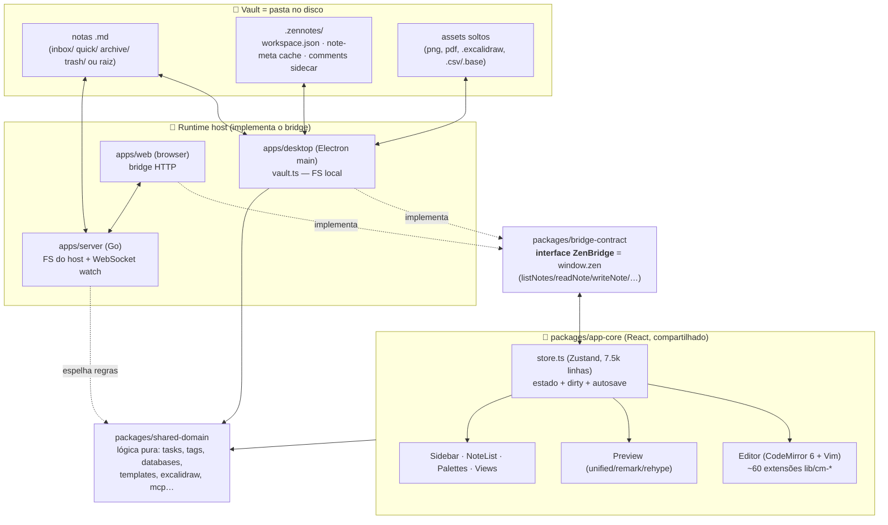

# ZenNotes — Análise Completa do Core de Notas (`.md`)

> Análise do componente central do **ZenNotes** (`C:\Projects\Teste\zennotes`, monorepo TS v2.10.0): **as notas em Markdown**. Cobre todo o caminho do dado — do arquivo `.md` no disco até a UI — com caminhos de arquivo, o que cada peça é, o que faz, como faz e como interage.
>
> Legenda de confiança: tudo aqui foi lido/verificado no código, exceto onde marco _(inferido)_.

---

## 1. Modelo mental em uma frase

**ZenNotes é um app de Markdown "plain-files first": a nota É um arquivo `.md` no disco.** Não há banco de dados proprietário guardando conteúdo. Tudo — tags, links, tarefas, arquivo/lixeira, busca — é feature construída _por cima_ de arquivos e pastas. Um **core de produto compartilhado** (React) fala com o sistema através de um **bridge tipado**, e cada **runtime** (Electron desktop, web/servidor Go) implementa esse bridge à sua maneira.

Consequência de design (do próprio doc do repo, `docs/explanation/how-zennotes-works.md`): o app gasta muito esforço em **resolução de caminhos, file watching, interpretação de layout do vault, semântica de soft-delete/archive e mudanças externas** — porque não tem o controle total que um banco daria.

---

## 2. Arquitetura em camadas



### Onde cada coisa mora (`docs/reference/runtime-and-package-map.md`)

| Caminho | O que é | Responsabilidade |
|---|---|---|
| `apps/desktop/` | Electron shell | Janela, preload/bridge, menus nativos, updater, **acesso local ao vault (`vault.ts`)**, remote workspace, floating windows |
| `apps/web/` | Shell browser (Vite) | Bootstrap do browser, bridge HTTP com o mesmo shape `window.zen`; **monta a UI do `app-core`, não reimplementa** |
| `apps/server/` | Backend Go | API HTTP, WebSocket watch, I/O do vault no host, auth/sessão, headers de segurança, serve o bundle web |
| `packages/app-core/` | **Fonte da verdade do produto** | React shell, store Zustand, editor, preview, palettes, sidebar, todas as views |
| `packages/bridge-contract/` | Contrato de runtime | Interface `ZenBridge` (`bridge.ts`), tipos IPC (`ipc.ts`), templates |
| `packages/shared-domain/` | Domínio puro | Tipos/modelos não-visuais: tasks, databases, mcp, temas, overrides… |
| `packages/shared-ui/` | Primitivas de UI | Pequeno hoje; UI reutilizável sem arrastar o app inteiro |

---

## 3. O que É uma "nota" — o modelo de dados

Definido em **`packages/bridge-contract/src/ipc.ts`**.

### `NoteMeta` (metadados — o que a lista/sidebar usa)
```ts
interface NoteMeta {
  path: string          // relativo à raiz do vault, sempre POSIX
  title: string         // nome do arquivo sem extensão
  folder: NoteFolder    // 'inbox' | 'quick' | 'archive' | 'trash'
  siblingOrder: number  // ordem de leitura no diretório (0-based)
  createdAt: number     // birthtime (ms)
  updatedAt: number     // mtime (ms)
  size: number
  tags: string[]        // #tags únicas extraídas do corpo
  wikilinks: string[]   // alvos [[wikilink]] de saída
  assetEmbeds: string[] // alvos ![[asset]] / 
  hasAttachments: boolean // referencia algum asset local não-texto?
  excerpt: string       // ~200 chars do corpo sem "ruído" markdown
  isSymlink?: boolean
}
```

### `NoteContent extends NoteMeta`
```ts
interface NoteContent extends NoteMeta {
  body: string  // markdown cru, INCLUINDO frontmatter
}
```

**Pontos-chave:**
- **Não há "id" de nota** — a identidade é o `path` relativo. Renomear/mover reescreve o path e o app propaga (ver §5, `renameNote`).
- **`title` = nome do arquivo**, não um campo de frontmatter. É o modelo Obsidian-like.
- **Metadados são derivados do corpo a cada leitura** (com cache por mtime+size), não guardados num banco.

### `NoteFolder` — as 4 áreas de ciclo de vida
`'inbox' | 'quick' | 'archive' | 'trash'` (`ipc.ts:238`). São **conceitos de produto**, não só pastas:
- `inbox` — notas ativas (ou a raiz do vault, no modo "Vault root")
- `quick` — captura rápida
- `archive` — guardado mas fora de circulação (move de pasta)
- `trash` — soft-delete recuperável, com "esvaziar"

`PrimaryNotesLocation = 'inbox' | 'root'` decide se a área principal é `inbox/` ou a raiz do vault (melhor para vaults Obsidian importados).

### Comentários (`NoteComment`) — sidecar, não inline
Comentários **não** ficam no `.md`. Ficam num sidecar JSON (`.zennotes/…`) com **âncoras por offset** (`anchorStart/anchorEnd/anchorText`) para reancorar após edições. Estrutura em `ipc.ts:446`.

---

## 4. O bridge — `window.zen` (a API de notas)

**`packages/bridge-contract/src/bridge.ts`** define `interface ZenBridge`. É a única forma da UI tocar o sistema — ela depende dessa interface, nunca de Electron/fetch direto. Instalado via `installZenBridge()` em `window.zen`.

Operações de nota (assinaturas reais):
```ts
listNotes(): Promise<NoteMeta[]>
listNotesPage?(req): Promise<ListNotesPageResponse>   // paginação para vaults grandes
readNote(relPath): Promise<NoteContent>
writeNote(relPath, body): Promise<NoteMeta>
appendToNote(relPath, body, 'start'|'end'): Promise<NoteMeta>
createNote(folder, title?, subpath?): Promise<NoteMeta>
renameNote(relPath, nextTitle): Promise<NoteMeta>
deleteNote(relPath): Promise<void>
moveToTrash / restoreFromTrash / emptyTrash
archiveNote / unarchiveNote
duplicateNote / moveNote / exportNotePdf / revealNote
readNoteComments / writeNoteComments
scanTasks / scanTasksForPath                          // tarefas
openDatabase / writeDatabaseRows / createDatabase…    // .csv/.base
createExcalidraw / convertObsidianExcalidraw          // diagramas
listFolders / createFolder / renameFolder / deleteFolder…
listAssets / importFilesToNote / importPastedImage…
onVaultChange(cb) / onOpenNoteRequested(cb)           // eventos/watch
```

Capacidades por runtime (`ZenCapabilities`): `supportsUpdater`, `supportsNativeMenus`, `supportsFloatingWindows`, `supportsLocalFilesystemPickers`, `supportsRemoteWorkspace`, `supportsCliInstall`, `supportsCustomTemplates`. É assim que a UI sabe o que esconder no web vs desktop.

---

## 5. A camada de disco — `apps/desktop/src/main/vault.ts` (3.806 linhas, ~50 funções)

É **o coração**: transforma arquivos `.md` em `NoteMeta`/`NoteContent` e implementa cada operação de ciclo de vida. Roda no **processo main do Electron** (Node/FS). No web, o servidor Go faz o equivalente.

### 5.1 Leitura de metadados — `readMeta()` (`vault.ts:2361`)
Como um `.md` vira `NoteMeta`, passo a passo:
1. `fs.stat(abs)` → tamanho, `birthtimeMs` (=createdAt), `mtimeMs` (=updatedAt).
2. **Cache**: chave por caminho; hit se `mtimeMs` e `size` batem → retorna meta cacheada (só re-resolve `siblingOrder` e `isSymlink`, que não podem ficar velhos atrás do cache).
3. `title = basename(abs, ext)`.
4. Se for `.excalidraw` (JSON, não markdown) → pula extração (tags/links vazios).
5. Senão lê o corpo e extrai: `extractTags`, `extractWikilinks`, `extractAssetEmbeds`, `bodyHasLocalAsset` (→ `hasAttachments`), `buildExcerpt`.
6. Grava no `noteMetaCache` (por mtime+size).

Extração (todas ignoram blocos de código para não vazar `#` de comentários — `vault.ts:1506+`):
- `extractTags` — `#tags` únicas fora de fences/inline code.
- `extractWikilinks` — alvos `[[wikilink]]`.
- `extractAssetEmbeds` — `![[asset]]` e `` (embeds de imagem/arquivo).

### 5.2 Varredura do vault — `listNotes()` (`vault.ts:2523`)
1. `hydratePersistedNoteMetaCache(root)` — carrega o cache de meta persistido em `.zennotes/`.
2. **Walk recursivo** de cada uma das 4 `FOLDERS`, resolvendo symlinks (com set de `ancestors` para evitar loops), pulando `.` (ocultos) e entradas ocultas da raiz primária.
3. Aceita entradas que são `isMarkdownNoteEntry` **ou** `isExcalidrawFileEntry`.
4. `mapLimit(..., NOTE_META_READ_CONCURRENCY, readMeta)` — lê meta em paralelo com limite de concorrência.
5. `recordMainPerf` (telemetria de perf) + `schedulePersistNoteMetaCache` (regrava o cache).

> Observação de robustez: há **cache de meta persistido** + **cache de candidatos de busca** — o app foi otimizado para vaults grandes (existe `perf:large-vault` em `tooling/scripts`).

### 5.3 Ler uma nota — `readNote()` (`vault.ts:2643`)
`resolveSafe(root, rel)` (§5.6) → descobre `folder` → `fs.readFile(utf8)` → `readMeta` → retorna `{ ...meta, body }`.

### 5.4 Salvar — `writeNote()` (`vault.ts:2652`)
```
resolveSafe → mkdir -p (dirname) → fs.writeFile(utf8)
  → invalidateNoteMetaCache(root, rel)
  → invalidateVaultTextSearchCache(root)
  → readMeta (re-derivar meta fresca) → retorna NoteMeta
```
Ou seja: **salvar reescreve o arquivo inteiro** e devolve a meta nova (para a UI atualizar tags/links/excerpt). Há também `writeFileAtomic()` (`vault.ts:646`) usado em configs/estado (escreve em temp + rename) para não corromper em crash.

### 5.5 Ciclo de vida (todas retornam `NoteMeta`)
| Função | Linha | O que faz |
|---|---|---|
| `createNote(folder, title?, subpath?)` | 2997 | Cria `.md` novo; `uniqueTitle()` evita colisão; `sanitizeNoteTitle()` limpa o nome |
| `appendToNote(rel, body, 'start'\|'end')` | 2791 | Concatena no começo/fim (usado por quick-capture, daily rollover) |
| `renameNote(rel, nextTitle)` | 3107 | Renomeia o arquivo **e reescreve wikilinks** que apontavam pra ela (`wikilink-rename`) |
| `moveToTrash` / `restoreFromTrash` | 3232/3236 | Move pra `trash/` e de volta (soft-delete) |
| `archiveNote` / `unarchiveNote` | 3240/3244 | Move pra `archive/` e de volta |
| `emptyTrash(root)` | 3248 | Apaga de vez o conteúdo da lixeira |
| `deleteNote(rel)` | 3263 | Delete definitivo |
| `moveNote(rel, targetFolder, targetSubpath)` | 3656 | Move entre pastas/áreas |
| `duplicateNote(rel)` | 3689 | Copia |
| `createExcalidraw` / `convertObsidianExcalidraw` | 3020/3052 | Desenhos nativos `.excalidraw` |
| `importExternalNote(sourceAbsPath)` | 3091 | Importa `.md` de fora pro vault |

### 5.6 Segurança de caminho — `resolveSafe()` (`vault.ts:2634`)
Resolve `rel` contra a raiz e **lança se o caminho escapa do vault** (`Path escapes vault`). É a barreira contra path traversal — crítica no modo servidor/remoto.

### 5.7 Layout, settings e migrações
- `ensureVaultLayout(root)` (1188) — garante as pastas de sistema.
- `getVaultSettings`/`setVaultSettings` (1136/1147) — settings do vault (persistidos em `.zennotes/`).
- `folderRoot`, `folderForRelativePath`, `folderAbsolutePath` — resolução das 4 áreas ↔ disco.
- `migrateLooseAssets` (1228), `migrateLegacyDatabases` (1315) — compatibilidade com layouts antigos/Obsidian.
- `rootContentHiddenByInboxMode` (1115) — detecta notas na raiz que só o modo "root" mostraria (dispara o banner "Switch to Vault root").

### 5.8 Comentários (sidecar) — `readNoteComments`/`writeNoteComments` (2716/2729)
Lê/escreve JSON de comentários (`.zennotes/…`), normalizando: trim, dedupe por `id` (UUID), clamp de offsets, ordena por `createdAt`. **Independente do `.md`** — o corpo da nota nunca é poluído.

### 5.9 Busca de texto — `searchVaultText()` (`vault.ts:2590`)
Três backends com fallback: **builtin** (JS puro), **ripgrep** (se disponível no PATH) e **fzf**. Candidatos são cacheados; depois `rankSearchCandidates` + `hydrateSearchOffsets` (para destacar no resultado). `getVaultTextSearchCapabilities` detecta as ferramentas.

---

## 6. O estado no renderer — `packages/app-core/src/store.ts` (Zustand, 7.558 linhas)

O store é a ponte entre `window.zen` e a UI. Mantém, entre muitos campos:
- `noteContents` — corpos abertos (por path).
- `noteDirty` — flag de "não salvo" por path (`store.ts:2446` "Update an open note's body… Flags dirty").
- `noteComments` — comentários carregados.
- `noteBackstack` / `noteForwardstack` — histórico de navegação (jump), reescrito em rename (`rewriteNoteJumpHistory`, 1345).
- Layout de panes/tabs, pane ativo, etc.

**Fluxo de autosave (renderer → disco):**
```mermaid
sequenceDiagram
    participant U as Usuário (digita)
    participant E as Editor (CM6)
    participant S as store.ts
    participant B as window.zen
    participant V as vault.ts (main)
    participant D as Disco (.md)

    U->>E: edita
    E->>S: updateNoteBody(path, next)  // marca noteDirty[path]=true
    Note over S: debounce ~350ms (PATH_SAVE_DEBOUNCE_MS)
    S->>B: writeNote(path, next)
    B->>V: IPC → writeNote
    V->>D: mkdir -p + writeFile(utf8)
    V-->>V: invalida caches + readMeta
    V-->>S: NoteMeta fresca (tags/links/excerpt novos)
    S->>S: noteDirty[path]=false; atualiza lista/sidebar
```
Constantes reais: `PATH_SAVE_DEBOUNCE_MS = 350` (store.ts:2505), persistência de CSV em `DATABASE_SAVE_DEBOUNCE_MS = 400`.

**Estado de workspace por vault:** o store espelha tabs/layout/cursor em `<vault>/.zennotes/workspace.json` (debounced) via `readWorkspaceState`/`writeWorkspaceState` — e **descarta a escrita se o vault mudou durante o debounce** (evita gravar no vault errado, issue #292).

**Mudanças externas:** `window.zen.onVaultChange(cb)` alimenta o store quando arquivos mudam fora do app (edição externa, Git, Docker mount, outro cliente) — o app re-lê/re-concilia.

---

## 7. O editor — CodeMirror 6 + Vim (`components/Editor.tsx` + ~60 libs `cm-*`)

O editor é **CodeMirror 6** embrulhado, com **modo Vim** (via `@replit/codemirror-vim` _(inferido pelo padrão)_) e keymaps configuráveis (`lib/keymaps.ts`, `syncVimKeymaps`). Cada feature de edição é uma **extensão isolada** em `packages/app-core/src/lib/cm-*.ts` — o que torna o comportamento testável (quase todo `cm-*` tem `.test.ts` ao lado).

Catálogo das extensões de editor (agrupado):

| Grupo | Arquivos `lib/cm-*` | O que fazem |
|---|---|---|
| **Wikilinks** | `cm-wikilinks`, `cm-wikilink-render` | Autocompletar `[[`, renderizar/clicar links internos |
| **Tags** | `cm-hashtags` | Realce e autocompletar `#tag` |
| **Live preview / WYSIWYG** | `cm-live-preview`, `cm-wysiwyg-blocks`, `cm-wysiwyg-compose` | Renderiza markdown inline enquanto edita (negrito, headings, etc.) |
| **Slash commands** | `cm-slash-commands` | Menu `/` para inserir blocos |
| **Snippets/atalhos** | `cm-markdown-snippets`, `cm-date-shortcuts`, `cm-template-variables` | Expansões e variáveis de template |
| **Listas** | `cm-markdown-list-indent`, `cm-ordered-list-renumber` | Indentação e renumeração automática |
| **Tabelas** | `cm-table`, `cm-table-menu` | Editar/alinhar tabelas markdown, menu de tabela |
| **Frontmatter** | `cm-frontmatter` | Tratamento especial do bloco `---` de topo |
| **Headings/fold** | `cm-heading-fold` | Dobrar seções por heading |
| **Código** | `cm-code-block-flair`, `cm-code-block-font`, `cm-code-languages`, `cm-highlight` | Realce, fonte mono, linguagens, "flair" de bloco de código |
| **Vim** | `cm-vim-clipboard`, `cm-vim-default-keymap`, `cm-vim-display-line`, `vim-insert-escape`, `cm-yank-highlight` | Clipboard, keymap padrão, movimento por linha visual, realce de yank |
| **Navegação de autocomplete** | `cm-completion-nav` | Navegar sugestões pelo teclado |
| **Formatação** | `cm-format`, `format-markdown` | Comandos de formatação (bold/italic/etc.) |

Interações relacionadas (fora `cm-`): `editor-drops`, `editor-paste-images`, `editor-focus`, `editor-hydration`, `markdown-file-drop`, `image-block-dnd`, `ime`.

---

## 8. O preview / render de Markdown — `packages/app-core/src/lib/markdown.ts`

Pipeline **unified** (remark → rehype), tudo **sanitizado com DOMPurify**:

```
remark-parse
  → remark-gfm (tabelas, task lists, ~~strike~~)
  → remark-breaks (quebra de linha simples)
  → remark-math (+ rehype-katex → LaTeX)
  → remark-frontmatter (esconde o bloco ---)
  → [plugin custom] wikilinks [[…]] → nós tagueados class="wikilink"
  → remark-rehype (mdast → hast)
  → rehype-raw (HTML embutido)
  → rehype-highlight (código)
  → rehype-stringify
  → DOMPurify (allowlist de esquemas: https, mailto, zen, zen-asset, blob, data
              e de data-attrs: callouts, diagramas, assets locais, wikilinks…)
```

Recursos suportados pelo render (via `data-*` na allowlist do sanitizer):
- **Callouts** (`data-callout`)
- **Diagramas**: Mermaid, TikZ, JSXGraph, Function-Plot (`data-mermaid-source`, `data-tikz-source`, `data-jsxgraph-source`, `data-function-plot-source`) — renderizados por `lib/diagram-renderers.ts`, com pan/zoom (`diagram-pan-zoom`, `inline-diagram-pan-zoom`).
- **Assets locais** (`data-local-asset-*`) — resolvidos por `lib/local-assets.ts` + bridge `resolveLocalAssetUrl`/`resolveVaultAssetUrl` (esquema `zen-asset:`).
- **Wikilinks** e **transclusão** (`![[nota]]` embute o conteúdo — `lib/transclusion.ts`).
- Tabelas com larguras de coluna persistidas em comentário (`markdown-table.ts`, `parseColWidthsComment`).

Componentes: `Preview.tsx` / `LazyPreview.tsx`, `use-rendered-markdown.ts` (hook memoizado), `NoteHoverPreview` (preview ao passar o mouse num link).

---

## 9. Mapa de features sobre a nota (todas viram arquivo/derivação)

```mermaid
mindmap
  root((Nota .md))
    Metadados derivados
      #tags
      "[[wikilinks]] + backlinks"
      "![[embeds]] / assets"
      excerpt
    Ciclo de vida
      inbox
      quick capture
      archive
      trash (restore/empty)
    Estrutura
      frontmatter
      outline (headings)
      transclusão
    Produtividade
      tasks (- [ ])
      daily / weekly notes
      templates
      comentários (sidecar)
    Dados
      databases CSV (Table/Board)
      excalidraw
      diagramas (mermaid/tikz…)
    Descoberta
      busca (builtin/ripgrep/fzf)
      command/search palettes
      tags view / connections
```

### 9.1 Tarefas — `shared-domain/src/tasks.ts` (`VaultTask`) + `tasklists.ts`
Tarefas são **linhas `- [ ]` / `- [x]` dentro dos `.md`**. O main varre com `scanTasks()`/`scanTasksForPath()` (bridge). Tokens tipo `due:` são parseados; em daily notes, `tasksDueOnNoteDate` deriva o vencimento da data da nota sem escrever `due:`. `rolloverUnfinishedTasks` move tarefas não-feitas de daily notes antigas pra de hoje. Views: `TasksView`, `TasksKanban`, `TasksCalendar`, `TasksRow`; filtro em `lib/tasks-filter.ts`; referência em `docs/reference/tasks-reference.md`.

### 9.2 Tags — `shared-domain/src/tags.ts` + `lib/tags.ts`
`#tags` extraídas do corpo (ignorando código). Alimentam `NoteMeta.tags`, a `TagView.tsx` e o autocomplete no editor.

### 9.3 Wikilinks, backlinks e transclusão
- `[[nota]]` → `NoteMeta.wikilinks` (saída). Navegação: `lib/wikilinks.ts`, `wikilink-navigation.ts`, `internal-links.ts`.
- **Backlinks** (quem aponta pra esta nota) são computados invertendo os wikilinks de todas as metas → `ConnectionsPanel.tsx`.
- **Transclusão** `![[nota]]` embute o conteúdo no preview (`lib/transclusion.ts`).
- Renomear uma nota **reescreve os wikilinks** nas outras (`wikilink-rename` no main).

### 9.4 Daily / Weekly notes
Opcionais (`DailyNotesSettings` em `ipc.ts`). Uma nota por dia/semana ISO, em diretórios com **padrões de data** (`yyyy/MM-MMM`, `yyyy-MM-dd-EEE`, `yyyy-'W'ww`), locale configurável. Doc: `docs/reference/vault-and-folder-model.md §Daily and weekly`.

### 9.5 Quick capture
Janela flutuante global (hotkey `CommandOrControl+Shift+Space`, `DEFAULT_QUICK_CAPTURE_HOTKEY`), grava em `quick/` via `appendToNote`/`createNote`. `QuickCaptureApp.tsx`, `QuickNotesView.tsx`, `lib/quick-capture-save.ts`, `quick-note-title.ts`.

### 9.6 Databases (Notion-like sobre CSV) — `shared-domain/src/databases.ts` + `database-csv.ts`
Tabelas/Boards sobre arquivos **`.csv` puros** dentro de uma pasta `.base/` (com sidecar de schema/views). Bridge: `openDatabase`, `writeDatabaseRows`, `writeDatabaseSchema`, `createDatabase`, `renameDatabase`, `createRecordPage`. Views: `DatabaseView`, `DatabaseTableView`, `DatabaseBoardView`. Persistência debounced (400ms) com "echo suppression" (não reprocessar o próprio write).

### 9.7 Excalidraw & diagramas
Desenhos nativos `.excalidraw` (JSON) tratados como "notas" na varredura mas sem extração de meta. `createExcalidraw`, `convertObsidianExcalidraw`. `ExcalidrawView`/`LazyExcalidrawView`, `shared-domain/excalidraw.ts`. Diagramas de texto (mermaid/tikz/jsxgraph/function-plot) renderizados no preview (§8); TikZ via `renderTikz` no bridge (compila no main).

### 9.8 Templates — `shared-domain/builtin-templates.ts` + `template-files.ts`
Templates embutidos + custom (`listTemplates`/`readTemplate`/`writeTemplate`/`deleteTemplate`, só onde `supportsCustomTemplates`). Variáveis via `lib/template-render.ts` + `cm-template-variables`. UI: `TemplatePalette`, `TemplateEditorModal`.

### 9.9 Comentários — `CommentsPanel.tsx` (sidecar, §5.8)
Ancorados por offset+texto no editor; sobrevivem a edições por reancoragem.

### 9.10 Assets & arquivos locais
Arquivos soltos (png/svg/pdf/áudio/vídeo/genéricos) são "vault files". Embeds estilo Obsidian `![[image.png]]`. `AssetsView`, `lib/local-assets.ts`, `lib/asset-tabs.ts`. Novos referenciados vão pra raiz do vault por padrão; `attachements/` e `_assets/` reconhecidos por compat.

### 9.11 Busca & navegação
`SearchPalette`, `CommandPalette`, `BufferPalette`, `OutlinePalette`, `TemplatePalette`. Libs: `note-search.ts`, `fuzzy-score.ts`, `settings-search.ts`, `palette-nav.ts`, `command-history.ts`. Busca de texto full-vault em `vault.ts` (§5.9).

### 9.12 Outline
Extrai headings (`lib/outline.ts`) → `OutlinePanel`, `OutlinePalette`, jump por outline no preview (`preview-outline-jump`, `preview-heading-fold`).

### 9.13 MCP
Integração Model Context Protocol (`shared-domain/mcp-clients.ts`, bridge `mcpInstall`/`mcpGetStatuses`/`mcpSetInstructions`) — expõe o vault a clientes MCP. `ConnectionsPanel`/settings.

---

## 10. Como as camadas interagem (resumo do fluxo)

**Abrir uma nota:**
`Sidebar/NoteList` (clique) → `store` seleciona path → `window.zen.readNote(path)` → `vault.ts readNote` (FS) → `NoteContent` → `store.noteContents[path]` → `Editor` hidrata (CM6) e `Preview` renderiza (unified) → `readNoteComments` popula `CommentsPanel`.

**Editar & salvar:** §6 (debounce 350ms → `writeNote` → meta fresca → UI atualiza tags/links).

**Mudança externa:** watcher (Electron `chokidar`/Go WebSocket) → `onVaultChange` → store reconcilia (recarrega meta/lista).

**Renomear:** `renameNote` (FS move + reescreve wikilinks nas outras notas) → store reescreve path em contents/dirty/backstack/comments (`rewriteNoteJumpHistory`, `rewriteNoteCommentsPath`).

---

## 11. Índice rápido de arquivos (o que abrir para cada coisa)

| Quero entender… | Abrir |
|---|---|
| Tipos de nota (fonte da verdade) | `packages/bridge-contract/src/ipc.ts` |
| API que a UI usa | `packages/bridge-contract/src/bridge.ts` |
| Disco: ler/escrever/lifecycle/meta | `apps/desktop/src/main/vault.ts` |
| Estado, dirty, autosave, workspace | `packages/app-core/src/store.ts` |
| Render de markdown | `packages/app-core/src/lib/markdown.ts` |
| Editor (CM6 + vim) | `packages/app-core/src/components/Editor.tsx` + `lib/cm-*.ts` |
| Tarefas | `packages/shared-domain/src/tasks.ts`, `tasklists.ts` |
| Databases CSV | `packages/shared-domain/src/databases.ts`, `database-csv.ts` |
| Backend web/servidor | `apps/server/` (Go) |
| Arquitetura (docs oficiais) | `docs/explanation/how-zennotes-works.md`, `docs/reference/vault-and-folder-model.md`, `docs/reference/runtime-and-package-map.md` |

---

## 12. Se o objetivo é portar o core para o momor (Zed/Rust)

O que É "o core de notas" que dá pra copiar de conceito:
1. **Modelo plain-file**: nota = `.md` no disco, identidade = path relativo, título = nome do arquivo, metadados **derivados** (tags/wikilinks/excerpt) com cache por mtime+size.
2. **4 áreas de lifecycle** (inbox/quick/archive/trash) como move de pasta.
3. **Camada de I/O isolada** (equivalente ao `vault.ts`) com: `list/read/write/create/rename/move/trash/archive`, `resolveSafe` (anti-traversal), write atômico, invalidação de cache.
4. **Metadados derivados** on-read: extrair `#tags`, `[[wikilinks]]`, `![[embeds]]`, excerpt — ignorando blocos de código.
5. **Autosave debounced** (~350ms) com flag dirty.
6. **Sidecar** para o que não cabe no `.md` (comentários, workspace state) sob `.zennotes/`.
7. **Watcher** para mudanças externas.
8. Features derivadas (backlinks = inverter wikilinks; outline = headings; tasks = linhas `- [ ]`; daily notes = padrão de data).

> O momor hoje guarda notas num **SQLite** (`crates/notebook/store.ts`… na verdade `store.rs`), não em `.md` no disco — o modelo é o oposto do ZenNotes. Portar o "core ZenNotes" significaria trocar (ou espelhar) para arquivos `.md`, o que é uma decisão de arquitetura, não um copy-paste. As **ideias derivadas** (tags/wikilinks/backlinks/outline/tasks a partir do markdown) são as mais reaproveitáveis independente do storage.
